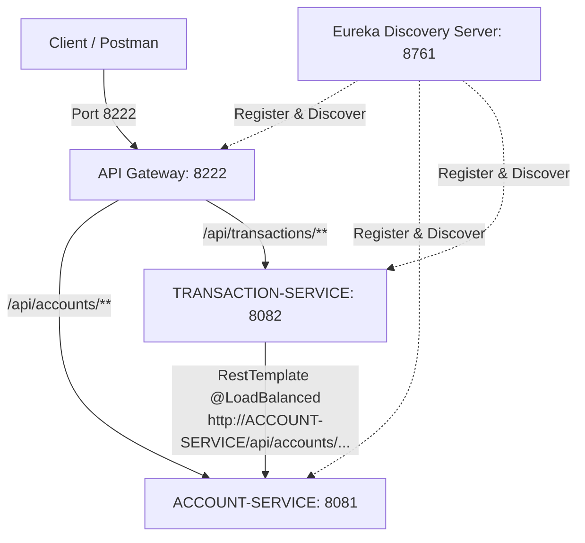
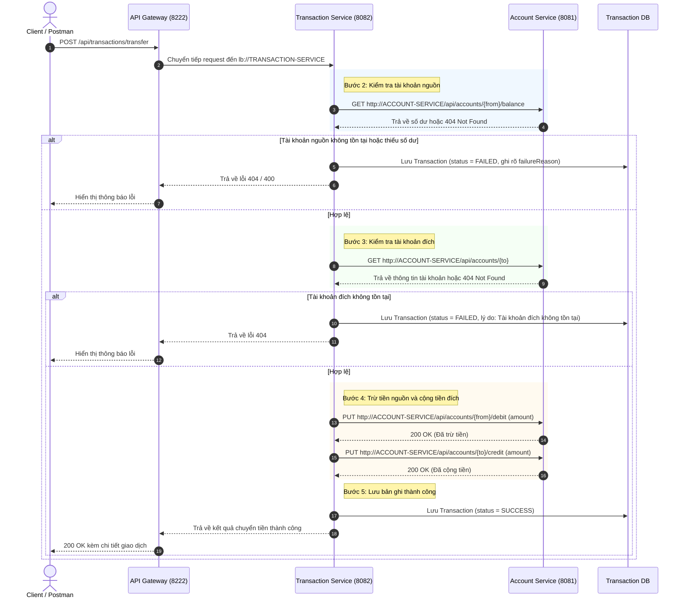

# FinBank Microservices - Giao Tiếp Đồng Bộ Bằng RestTemplate

> **Bài Tập Tổng Hợp 3: Giao tiếp đồng bộ giữa các Microservice bằng RestTemplate**  
> **Cấp độ**: Vận dụng chuyên sâu | Tổng hợp kiến thức Session 05 & 06

---

## 1. Giới Thiệu & Kiến Trúc Hệ Thống

Hệ thống FinBank triển khai nghiệp vụ chuyển tiền (**Transfer**) thông qua giao tiếp đồng bộ (Synchronous Communication) sử dụng **`RestTemplate`** kết hợp **`@LoadBalanced`** và cơ chế khám phá dịch vụ **Eureka Service Discovery**, tiếp nhận toàn bộ request từ người dùng thông qua **API Gateway** tại cổng **`8222`**.

### Sơ Đồ Kiến Trúc (System Architecture)



### Danh Sách Dịch Vụ & Cổng (Ports)

| Tên Dịch Vụ | Thư Mục | Cổng (Port) | Eureka Service ID | Chức Năng Chính |
| :--- | :--- | :--- | :--- | :--- |
| **Discovery Service** | `discovery-service` | `8761` | `DISCOVERY-SERVICE` | Eureka Server đăng ký và quản lý dịch vụ |
| **API Gateway** | `api-gateway` | `8222` | `API-GATEWAY` | Cổng tiếp nhận duy nhất, định tuyến request |
| **Account Service** | `account-service` | `8081` | `ACCOUNT-SERVICE` | Quản lý tài khoản, số dư, nạp/trừ tiền (`debit`/`credit`) |
| **Transaction Service** | `transaction-service` | `8082` | `TRANSACTION-SERVICE` | Xử lý chuyển tiền, gọi `RestTemplate`, lưu lịch sử |

---

## 2. Luồng Nghiệp Vụ Chuyển Tiền (Transfer Flow)

Khi khách hàng gửi yêu cầu chuyển tiền đến `POST http://localhost:8222/api/transactions/transfer`:



---

## 3. Chi Tiết Triển Khai Theo Yêu Cầu Đề Bài

### Yêu Cầu 1: Bổ sung API cho Account Service
Account Service cung cấp đầy đủ các API:
- `GET /api/accounts/{accountNumber}`: Lấy thông tin tài khoản theo số tài khoản.
- `GET /api/accounts/{accountNumber}/balance`: Lấy số dư tài khoản.
- `PUT /api/accounts/{accountNumber}/debit`: Trừ tiền (request body: `{"amount": 2000000}`). Nếu số dư không đủ sẽ trả về HTTP 400 Bad Request.
- `PUT /api/accounts/{accountNumber}/credit`: Cộng tiền (request body: `{"amount": 2000000}`).

Dữ liệu khởi tạo mặc định (`DataInitializer`):
- Tài khoản `1001`: Chủ tài khoản "Nguyen Van A", số dư **10,000,000 VND**.
- Tài khoản `1002`: Chủ tài khoản "Tran Thi B", số dư **5,000,000 VND**.

### Yêu Cầu 2: Cấu hình `RestTemplate` với `@LoadBalanced`
Tại `transaction-service/src/main/java/com/finbank/transaction/config/AppConfig.java`:
```java
@Configuration
public class AppConfig {

    @Bean
    @LoadBalanced
    public RestTemplate restTemplate() {
        return new RestTemplate();
    }
}
```
`@LoadBalanced` cho phép `RestTemplate` tự động phân giải tên dịch vụ đã đăng ký với Eureka (ví dụ `http://ACCOUNT-SERVICE/api/accounts/...`) thay vì phải hard-code IP/cổng tĩnh.

### Yêu Cầu 3: API chuyển tiền trong Transaction Service
- Endpoint: `POST /api/transactions/transfer`
- Request body:
  ```json
  {
      "fromAccountNumber": "1001",
      "toAccountNumber": "1002",
      "amount": 2000000,
      "description": "Chuyển tiền thanh toán hóa đơn"
  }
  ```
- Kết quả lưu vào database với `status`: `SUCCESS` hoặc `FAILED` kèm `failureReason`.
- Cơ chế bù trừ (**Compensating Transaction**): Trong trường hợp trừ tiền nguồn thành công nhưng cộng tiền đích thất bại do sự cố kỹ thuật, hệ thống tự động hoàn lại tiền cho tài khoản nguồn để đảm bảo toàn vẹn dữ liệu.

---

## 4. Hướng Dẫn Khởi Động Hệ Thống

### Thứ Tự Khởi Động Khuyến Nghị
Mở 4 cửa sổ terminal riêng biệt và chạy lần lượt các lệnh:

```bash
# 1. Khởi động Eureka Discovery Server (Port 8761)
./gradlew :discovery-service:bootRun

# 2. Khởi động Account Service (Port 8081)
./gradlew :account-service:bootRun

# 3. Khởi động Transaction Service (Port 8082)
./gradlew :transaction-service:bootRun

# 4. Khởi động API Gateway (Port 8222)
./gradlew :api-gateway:bootRun
```

Kiểm tra trạng thái đăng ký tại Eureka Dashboard: [http://localhost:8761](http://localhost:8761). Khi cả 3 service `API-GATEWAY`, `ACCOUNT-SERVICE`, và `TRANSACTION-SERVICE` hiển thị trạng thái `UP`, hệ thống đã sẵn sàng tiếp nhận request.

---

## 5. Hướng Dẫn Kiểm Thử Trên Postman (Yêu Cầu 4)

File collection đầy đủ nằm tại:
`postman/FinBank_Microservices.postman_collection.json`

Nhập file này vào Postman. Tất cả các request đều gọi qua **API Gateway tại cổng 8222**.

### Test Case 1: Chuyển 2,000,000 VND từ 1001 sang 1002 (Thành công)
1. **Thực hiện chuyển tiền**:
   - **Method**: `POST`
   - **URL**: `http://localhost:8222/api/transactions/transfer`
   - **Body**:
     ```json
     {
         "fromAccountNumber": "1001",
         "toAccountNumber": "1002",
         "amount": 2000000,
         "description": "Chuyển tiền thanh toán hóa đơn"
     }
     ```
   - **Kết quả mong đợi**: HTTP `200 OK`, `status`: `"SUCCESS"`.
2. **Kiểm tra số dư 2 tài khoản sau khi chuyển**:
   - `GET http://localhost:8222/api/accounts/1001/balance` → `balance`: **`8,000,000.00`** (giảm 2tr)
   - `GET http://localhost:8222/api/accounts/1002/balance` → `balance`: **`7,000,000.00`** (tăng 2tr)

### Test Case 2: Chuyển 100,000,000 VND từ 1001 sang 1002 (Thất bại do thiếu số dư)
- **Method**: `POST`
- **URL**: `http://localhost:8222/api/transactions/transfer`
- **Body**:
  ```json
  {
      "fromAccountNumber": "1001",
      "toAccountNumber": "1002",
      "amount": 100000000,
      "description": "Chuyển tiền vượt số dư"
  }
  ```
- **Kết quả mong đợi**: HTTP `400 Bad Request`. Thông báo lỗi nêu rõ số dư hiện có không đủ. Bản ghi transaction được lưu với `status: "FAILED"`.

### Test Case 3: Chuyển tiền tới tài khoản không tồn tại 9999 (Thất bại)
- **Method**: `POST`
- **URL**: `http://localhost:8222/api/transactions/transfer`
- **Body**:
  ```json
  {
      "fromAccountNumber": "1001",
      "toAccountNumber": "9999",
      "amount": 2000000,
      "description": "Chuyển tiền tài khoản không tồn tại"
  }
  ```
- **Kết quả mong đợi**: HTTP `404 Not Found`. Thông báo nêu rõ tài khoản đích không tồn tại. Bản ghi transaction được lưu với `status: "FAILED"`.

### Tra Cứu Lịch Sử Giao Dịch
- **Method**: `GET`
- **URL**: `http://localhost:8222/api/transactions`
- Hiển thị danh sách tất cả các giao dịch đã thực hiện trong phiên, bao gồm cả các giao dịch thành công và thất bại kèm `failureReason`.

---

## 6. Chạy Kiểm Thử Tự Động (Automated Testing)

Toàn bộ hệ thống có thể được kiểm thử tự động bằng lệnh:
```bash
./gradlew test
```
Tất cả các kịch bản kiểm thử:
- Kiểm tra số dư, trừ tiền, nạp tiền, validate số dư trong `account-service`.
- Mô phỏng giao tiếp `RestTemplate` cho luồng thành công, thất bại do thiếu số dư, thất bại do tài khoản không tồn tại trong `transaction-service`.
Đều vượt qua (`BUILD SUCCESSFUL`).
